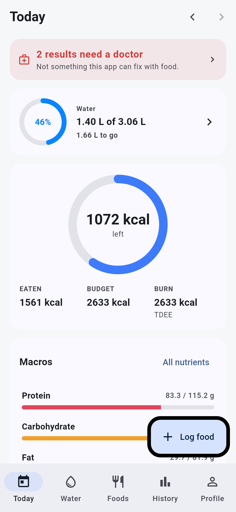
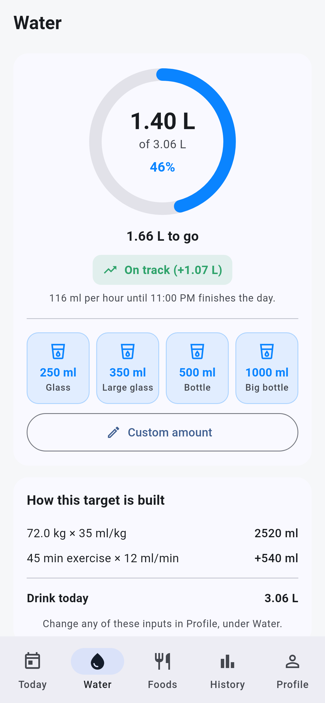
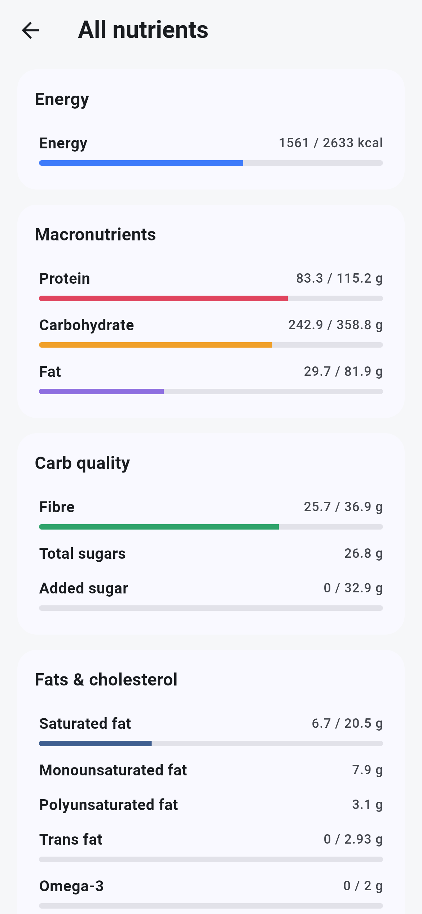
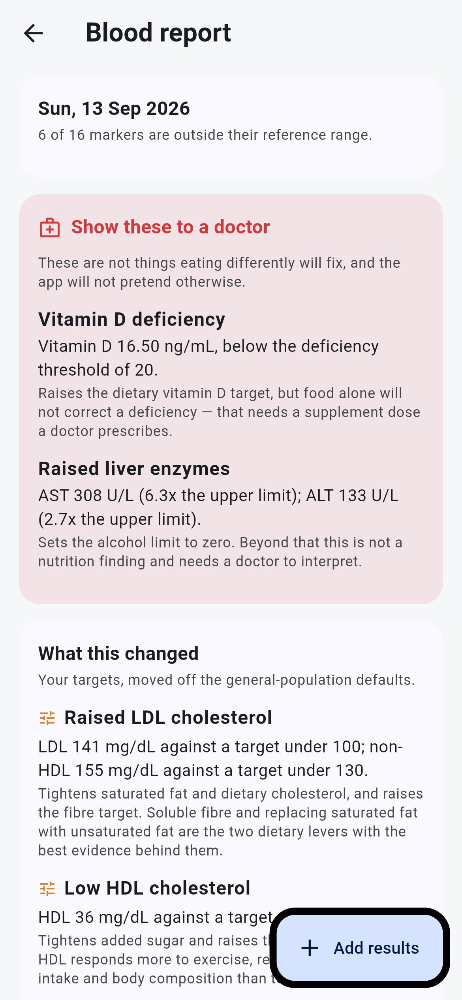
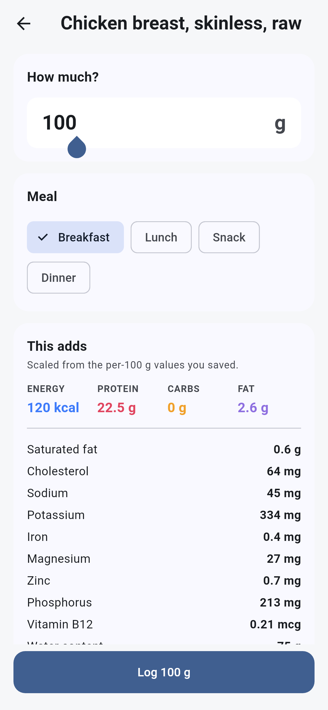
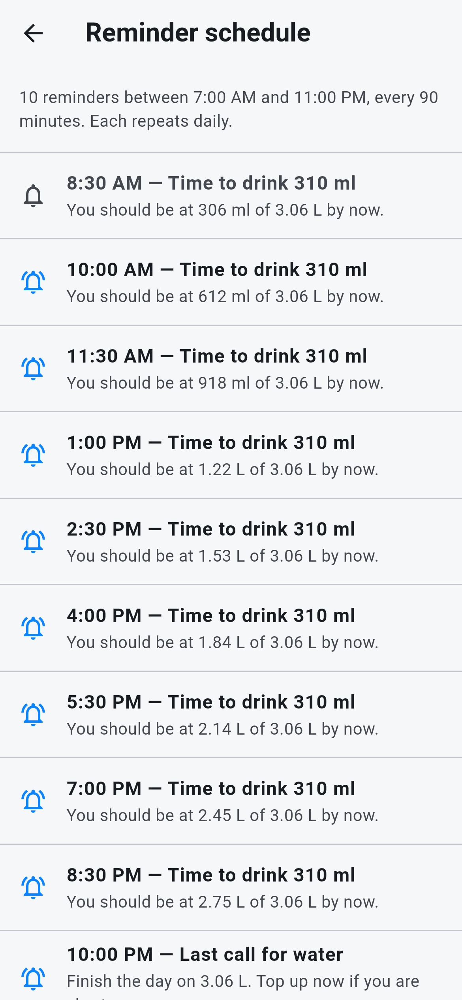

# HydraFuel

A precise water, macro and micronutrient tracker for iOS, built with Flutter.
Everything is stored on the phone — no account, no server, no network calls.

Built around two ideas:

1. **Water is the headline feature.** It gets its own tab, its own ring, a
   pace readout that tells you whether you are ahead or behind *right now*,
   and local notifications that fire on schedule without an internet
   connection.
2. **The arithmetic is exact.** You weigh your food, so the app should not
   round your inputs, guess at portions, or hide how a target was calculated.

---

## Getting it onto your phone

**This repository holds only the Dart source.** There is no `.xcodeproj` in it
— the `ios/` folder is generated, not committed. Opening the repository folder
in Xcode will not give you anything runnable until you run the bootstrap script
below.

You need a Mac with **Xcode** and the **Flutter SDK**
([install guide](https://docs.flutter.dev/get-started/install/macos)).

### 1. Prepare the phone (first time only)

On the iPhone:

- **Settings → Privacy & Security → Developer Mode → On**, then restart the
  phone. Required on iOS 16 and later; without it the phone will not appear as
  a target at all.
- Unlock it, plug it into the Mac, and tap **Trust This Computer**.

### 2. Generate the project and build

From Terminal, in the repository folder:

```bash
flutter doctor              # fix anything it flags first
./tool/bootstrap.sh         # generates ios/ and android/, keeps the source
flutter test                # the full suite, no device needed
flutter devices             # your iPhone should be listed
flutter run                 # builds, signs and installs
```

`bootstrap.sh` runs `flutter create` to produce the platform folders, which
would otherwise overwrite `lib/main.dart` and `pubspec.yaml` with its own
template — so it backs the source up first and restores it afterwards. If
anything fails midway it puts the source back before exiting. It also patches
`ios/Runner/AppDelegate.swift` to set the notification-centre delegate, without
which a reminder that fires while the app is open is delivered silently and
never appears.

### 3. Signing

The first `flutter run` will fail if Xcode has no signing identity. Open the
generated workspace:

```bash
open ios/Runner.xcworkspace
```

Select the **Runner** target → **Signing & Capabilities** → set **Team** to
your Apple ID (add it under Xcode → Settings → Accounts if it is not listed).

If Xcode says the bundle identifier is already taken, regenerate with your own
prefix and try again:

```bash
ORG=com.yourname ./tool/bootstrap.sh
```

Then run `flutter run` again.

### 4. Trust the app on the phone

The first install will refuse to launch with an untrusted-developer message.
On the iPhone: **Settings → General → VPN & Device Management →** your Apple
ID **→ Trust**. Launch it again after that.

**On signing:** a free Apple ID signs apps for 7 days, after which the app
stops launching until you `flutter run` again. A paid Apple Developer account
($99/year) extends that to a year. Either works; the free one just needs a
weekly reconnect.

Once installed it runs entirely offline. Both an iPhone 17 and an iPhone 11 can
have it, but they keep separate data — there is no sync. Use **Profile →
Export a backup** to move data between them.

---

## Screens

| Today | Water | All nutrients |
|:--:|:--:|:--:|
|  |  |  |
| Energy ring shows what is **left**, not what is eaten. The water strip carries live pace. | Ring, quick-add and the target's arithmetic, all on one screen. | Every tracked nutrient against its target; tap one for the reasoning. |

| Blood report | Logging food | Reminder schedule |
|:--:|:--:|:--:|
|  |  |  |
| What food can move, kept separate from what needs a doctor. | Exact grams in, full nutrition preview before you commit. | Every reminder and its exact wording, so they can be checked rather than trusted. |

The rest are in [`tool/screenshots/shots/`](tool/screenshots/shots/).

These are renders of the real widgets, not mockups. Regenerate them with:

```bash
flutter test tool/screenshots/app_screenshots_test.dart --update-goldens
```

The harness seeds a half-lived day — water logged, two meals in, a blood panel
recorded — and captures each screen at iPhone dimensions. It lives outside
`test/` on purpose: golden rendering differs between machines, so running it in
CI would fail for reasons that have nothing to do with the code.

---

## How the numbers are worked out

Every target in the app can be traced back to a formula. Tap any nutrient on
the **All nutrients** screen to see the reasoning that produced its number.

### Energy

| Step | Formula |
|---|---|
| BMR | Mifflin-St Jeor by default; Katch-McArdle if you enter body fat % |
| TDEE | BMR × activity factor (1.20 sedentary → 1.90 twice-daily training) |
| Budget | TDEE + goal adjustment |
| Goal adjustment | `rate_kg_per_week × 7700 ÷ 7` kcal/day |

The deficit is **clamped so your budget never falls below BMR**. Asking for
1.5 kg/week when your maintenance is 2136 kcal gets you a 356 kcal deficit,
not a 1650 kcal one.

### Macros

| Macro | Rule |
|---|---|
| Protein | g/kg of body weight, or of lean mass if you know your body fat % |
| Fat | % of energy at 9 kcal/g, with a hard floor of 0.5 g/kg body weight |
| Carbs | whatever energy remains, at 4 kcal/g |
| Fibre | 14 g per 1000 kcal (Institute of Medicine) |

The three macros always reconstruct the calorie budget exactly — that is
asserted in the test suite, not assumed.

### Water

```
baseline   = body weight (kg) × 35 ml/kg
exercise   = minutes/day × 12 ml/min
climate    = 0 / 500 / 1000 ml for temperate / warm / hot
─────────────────────────────────────────────
total      = baseline + exercise + climate
to drink   = total − water from food (optional, off by default)
```

The food-water credit is opt-in and can never drag the goal below 1 litre.
Every term is adjustable in **Profile → Water**, and the breakdown is shown
on the Water tab so you can see where the number came from.

### Limits

Saturated fat ≤10% of energy, trans fat ≤1%, added sugar ≤10% (WHO), sodium
≤2000 mg, cholesterol ≤300 mg. Micronutrient targets are adult RDAs adjusted
for your sex and age.

---

## Blood results

The defaults above are general-population figures. **Profile → Blood report**
takes the numbers off your own panel and moves the ones your results justify.

Targets always follow your **most recent draw**, so re-testing in three months
moves them on its own — nothing needs reconfiguring, and a result that comes
back normal drops the adjustment it was causing.

| Result | What changes |
|---|---|
| LDL over 100, or non-HDL over 130 | Saturated fat 10% → 7% of energy; cholesterol 300 → 200 mg; fibre floor of 30 g |
| HDL under 50 | Added sugar 10% → 5% of energy; omega-3 raised to 2 g |
| Triglycerides over 150 | Added sugar → 5%; omega-3 → 2 g; alcohol → 0 |
| HbA1c 5.7 or over | Added sugar → 5%; fibre floor of 30 g |
| Vitamin D under 20 / under 30 | Dietary vitamin D → 25 mcg / 20 mcg |
| B12 under 400 | B12 target 2.4 → 4 mcg |
| AST or ALT above range | Alcohol limit → 0 |
| Uric acid over 7 | +500 ml on the daily water target; alcohol → 0 |
| eGFR under 90 | Protein capped at 0.8 g/kg; sodium → 1500 mg; potassium and phosphorus become limits |
| Haemoglobin or ferritin low | Iron ×1.5; vitamin C → 200 mg to aid absorption |

Three rules the app holds to here:

- **It never pretends a medical problem is a diet problem.** Raised liver
  enzymes, a vitamin D deficiency, an out-of-range TSH — these are shown as
  *"Show these to a doctor"*, with a standing prompt on the diary, and the
  app makes only the one change it can honestly justify (alcohol to zero).
  It will not imply that eating differently fixes them.
- **An adjustment only ever moves a target in the safe direction.** The
  kidney protein ceiling lowers a high target and never raises a low one; the
  fibre floor lifts a low target and never lowers a high one.
- **Precedence is explicit**: population default, then your blood results,
  then anything you set by hand. Tap any nutrient in **All nutrients** to see
  which of the three produced the number in front of you, and why.

Only markers you actually enter are considered — a blank field records nothing,
which is different from recording a zero, and an unrecorded marker never
produces a flag.

---

## Precision, specifically

These are deliberate design decisions, not incidental details:

- **Nothing is rounded until it is drawn on screen.** Values are stored and
  summed as doubles. A day's total is the exact sum of its entries.
- **One multiplication.** Nutrition is stored per 100 g. Everything else —
  servings, millilitres, "two rotis" — is converted to grams once, then
  scaled as `per_100g × grams ÷ 100`. Errors cannot compound.
- **Unknown is not zero.** A food whose label omitted iron shows "—", not
  "0 mg". The app will not claim a food contains none of something just
  because you did not type a number.
- **Logged entries snapshot their food.** Correcting a food's nutrition
  tomorrow does not rewrite what you ate last Tuesday. Deleting a food from
  your library leaves your history intact.
- **Bad data is caught at entry.** Saving a food cross-checks its stated
  calories against its own macros using Atwater factors (protein 4, carbs 4,
  fibre 2, fat 9, alcohol 7 kcal/g). If the label claims 1200 kcal for
  something whose macros imply 120, it says so before you save. It also
  rejects impossible combinations — fat fractions exceeding total fat, sugars
  plus fibre exceeding carbohydrate, macros summing past 100 g per 100 g.
- **Volumes convert through real density.** Milk at 1.03 g/ml, oil at 0.92.
  A food with no recorded density refuses to guess rather than assuming 1.0.
- **Days are local calendar days**, stored as `yyyy-MM-dd` next to each
  timestamp, so grouping never depends on timezone maths at query time.

---

## Water reminders

Scheduled as **local** notifications, held by the phone itself. No push
server, no certificate, no internet.

- Spread evenly between your wake and sleep times at your chosen interval.
- Each one names the amount to drink and the cumulative total you should be
  at by that time.
- The last one of the day is a "last call" rather than another interval
  prompt.
- iOS holds at most 64 pending local notifications per app. If your interval
  would need more than that, the app **widens the interval and tells you**,
  rather than letting the evening reminders silently vanish.

**Profile → Reminders → See schedule** lists every reminder and its exact
wording. **Send a test** fires one immediately so you can confirm permissions
actually took.

---

## Logging food

The library is yours to build. 26 reference foods are seeded on first launch
(USDA FoodData Central values, Indian composition tables for roti and paneer)
— edit them, delete them, or replace the numbers with what is printed on the
packet you actually buy. A weighed input against your own packet beats a
database average every time.

When adding a food you can type values **per 100 g, per 100 ml, or per
serving**, and the app normalises to per 100 g on save. Most packets label per
serving, so this saves doing the division by hand.

Foods sort by how often you use them, so your real diet floats to the top
within a week.

---

## Your data

Local only, on one device. There is no account and nothing leaves the phone.
That includes your blood results: they are typed into the app, stored in its
database on the handset, and never committed to this repository or sent
anywhere.

That also means **an export is your only backup**. Profile → Export a backup
produces a JSON document with everything in it — profile, foods, every logged
meal and drink. Restoring replaces the contents of the phone in a single
transaction, so a malformed file leaves your existing data untouched.

---

## Project layout

```
lib/
  core/          dates, number and unit formatting, theme
  domain/        pure Dart: nutrients, targets, profile, blood markers
  data/          SQLite schema and repositories
  services/      notifications, backup
  state/         Riverpod providers and mutations
  ui/            screens and widgets
test/            unit tests for the arithmetic, widget tests for the app
```

`lib/domain/` has no Flutter imports and no I/O. Every calculation in the app
lives there and is unit-tested against hand-computed reference values.

```bash
flutter test              # everything
flutter analyze           # zero issues expected
```
